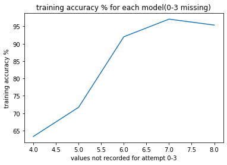
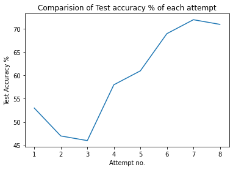
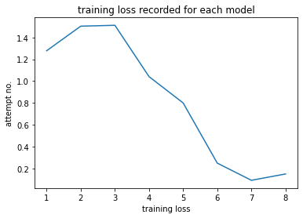
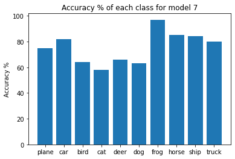

##  

 _Switch to dark mode for better readability_ 

The goal for this project was to build an Image Classifier for the Cifar-10 dataset.

To begin with I started with [PyTorch's Tutorial](https://pytorch.org/tutorials/beginner/blitz/cifar10_tutorial.html#sphx-glr-beginner-blitz-cifar10-tutorial-py) and then proceeded to make multiple changes to the model in an attempt to increase the test accuracy. I tried different things and came up with 7 different approaches(in addition to the existing default code) to tackle this problem.

[Here](https://github.com/rohanmandrekar/Cifar-10-/blob/master/best_attempt(model7).ipynb) is a link to the jupyter notebook with the best results

#### Here is a graph comparing the Training accuracy for modles 4 - 8 :
training accuracy is missing for models 1-3 because I added the attribute in the 4th model



#### Here is a comparision of Test accuracy for each model :



#### Here is a plot showing the trend in loss for each model :



#### This bar graph shows the accuracy of prediction for each class of image seperately :




### Model 1:
The first model was the default model provided by PyTorch. This model set the base for this project. My goal was to experiment with Network topology and other hyperparameters to improve the performance (increase test accuracy)
#### Test Accuracy : 53% ; Training Accuracy : not calculated ; Loss : 1.278

### Model 2:
To make the dataset more diverse I augmented the data a little using the following transforms :

**Random Horizontal Flip**: Randomly flips some images horizontally from the dataset with probability p=0.1
**Random Vertical Flip**: Randomly flips some images Vertically from the dataset with probability p=0.1
**Random Rotate 45deg**: Randomly rotates images by 45 degrees from the dataset with a probablility p=0.1

Surprisingly the Test accuracy in this case decreased, which was not expected.

```python
transform = transforms.Compose(
    [transforms.ToTensor(),
     transforms.Normalize((0.5, 0.5, 0.5), (0.5, 0.5, 0.5)),
     transforms.RandomHorizontalFlip(p=1),
     transforms.RandomVerticalFlip(p=1),
     transforms.RandomRotation(degrees = 45)
     ])
```     
#### Test Accuracy : 47% ; Training Accuracy : not calculated ; Loss : 1.503

### Model 3:

#### Test Accuracy : 53% ; Training Accuracy : not calculated ; Loss : 1.278

### Model 4:
#### Test Accuracy : 53% ; Training Accuracy : not calculated ; Loss : 1.278

### Model 5:
#### Test Accuracy : 53% ; Training Accuracy : not calculated ; Loss : 1.278

### Model 6:
#### Test Accuracy : 53% ; Training Accuracy : not calculated ; Loss : 1.278

### Model 7:
#### Test Accuracy : 53% ; Training Accuracy : not calculated ; Loss : 1.278

### Model 8:
#### Test Accuracy : 53% ; Training Accuracy : not calculated ; Loss : 1.278


