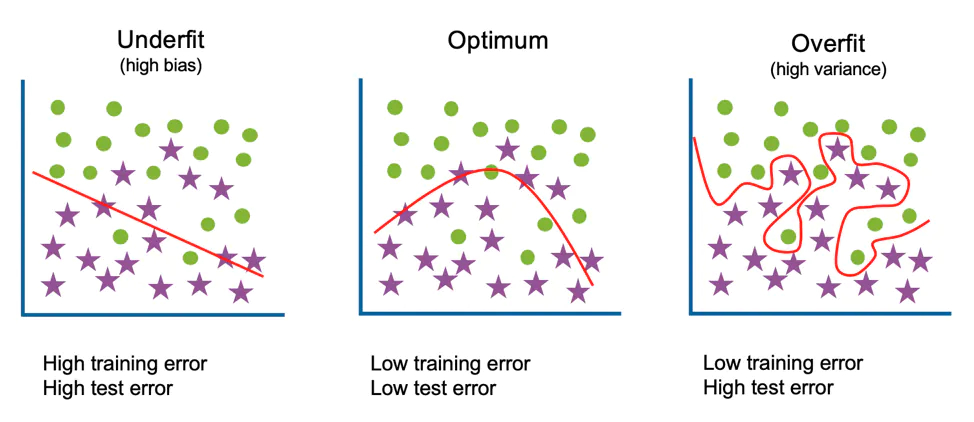

##  

 _Switch to dark mode for better readability_ 

###What is overfitting?

Overfitting is a concept in data science, which occurs when a statistical model fits exactly against its training data. When this happens, the algorithm unfortunately cannot perform accurately against unseen data, defeating its purpose. [_Source_](https://www.ibm.com/cloud/learn/overfitting)

###How is overfitting different from underfitting?

If overtraining or model complexity results in overfitting, then a logical prevention response would be either to pause training process earlier, also known as, “early stopping” or to reduce complexity in the model by eliminating less relevant inputs. However, if you pause too early or exclude too many important features, you may encounter the opposite problem, and instead, you may underfit your model. Underfitting occurs when the model has not trained for enough time or the input variables are not significant enough to determine a meaningful relationship between the input and output variables.  [_Source_](https://www.ibm.com/cloud/learn/overfitting)

[_Source_](https://www.ibm.com/cloud/learn/overfitting)

The goal of this project was to learn about the concept of overfitting using higher order linear regression.

Here is the link to the [Jupyter Notebook](https://github.com/rohanmandrekar/overfitting-using-higher-order-linear-regression/blob/main/overfitting.ipynb)

### Challenges faced:
Adding another convolutional layer for me was the biggest challenge. on my first attempt of adding another convolutional layer I simply changed the input and output parameters not realising that the required dimensions after flattening would also need to be changed. After facing errors after multiple trials i stumbled upon [Python Engineer's Tutorial on YouTube](https://www.youtube.com/watch?v=pDdP0TFzsoQ&t=882s&ab_channel=PythonEngineer) which perfectly explained how the dimesions of the image changes after applying each convolutional and MaxPool layer. Below is a screenshot from his video that explains the formula used to find the actual dimensions of the image after passing through the convolutional layer.

### My Observations:
On observing the bar chart below, you will notice that the model, even on it's best performance struggled to classify birds, cats, dogs, and deers. One reason for this that I could come up with was that cats, dogs, and deers being 4-legged animals might have been difficult to distinguish. In my opinion to tackle this problem the model should have been made a little more complex.

A trend that I observed was that the performance of the model increased when the number of nodes in the model were increased.

In the end this project was fun to do and was a great learning experience.

