##  

_Switch to dark mode for better readability_ : smile :

#### Hypothesis score : 0.76555

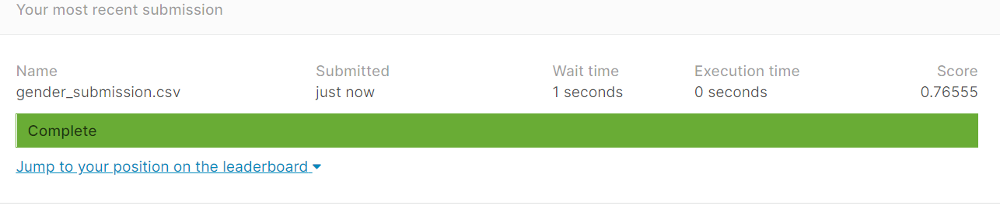

#### 1st submission score : 0.77511

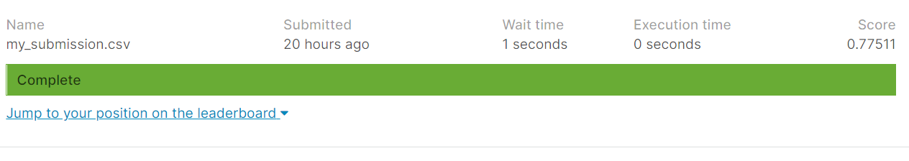

#### Final submission _improved_ score : 0.78468

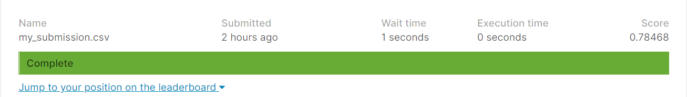


```python
# This Python 3 environment comes with many helpful analytics libraries installed
# It is defined by the kaggle/python Docker image: https://github.com/kaggle/docker-python
# For example, here's several helpful packages to load

import numpy as np # linear algebra
import pandas as pd # data processing, CSV file I/O (e.g. pd.read_csv)

# Input data files are available in the read-only "../input/" directory
# For example, running this (by clicking run or pressing Shift+Enter) will list all files under the input directory

import os
for dirname, _, filenames in os.walk('/kaggle/input'):
    for filename in filenames:
        print(os.path.join(dirname, filename))

# You can write up to 20GB to the current directory (/kaggle/working/) that gets preserved as output when you create a version using "Save & Run All" 
# You can also write temporary files to /kaggle/temp/, but they won't be saved outside of the current session
```

    /kaggle/input/titanic/train.csv
    /kaggle/input/titanic/test.csv
    /kaggle/input/titanic/gender_submission.csv
    


```python
train_data = pd.read_csv("/kaggle/input/titanic/train.csv")
train_data.head()
```


<div>
<style scoped>
    .dataframe tbody tr th:only-of-type {
        vertical-align: middle;
    }

    .dataframe tbody tr th {
        vertical-align: top;
    }

    .dataframe thead th {
        text-align: right;
    }
</style>
<table border="1" class="dataframe">
  <thead>
    <tr style="text-align: right;">
      <th></th>
      <th>PassengerId</th>
      <th>Survived</th>
      <th>Pclass</th>
      <th>Name</th>
      <th>Sex</th>
      <th>Age</th>
      <th>SibSp</th>
      <th>Parch</th>
      <th>Ticket</th>
      <th>Fare</th>
      <th>Cabin</th>
      <th>Embarked</th>
    </tr>
  </thead>
  <tbody>
    <tr>
      <th>0</th>
      <td>1</td>
      <td>0</td>
      <td>3</td>
      <td>Braund, Mr. Owen Harris</td>
      <td>male</td>
      <td>22.0</td>
      <td>1</td>
      <td>0</td>
      <td>A/5 21171</td>
      <td>7.2500</td>
      <td>NaN</td>
      <td>S</td>
    </tr>
    <tr>
      <th>1</th>
      <td>2</td>
      <td>1</td>
      <td>1</td>
      <td>Cumings, Mrs. John Bradley (Florence Briggs Th...</td>
      <td>female</td>
      <td>38.0</td>
      <td>1</td>
      <td>0</td>
      <td>PC 17599</td>
      <td>71.2833</td>
      <td>C85</td>
      <td>C</td>
    </tr>
    <tr>
      <th>2</th>
      <td>3</td>
      <td>1</td>
      <td>3</td>
      <td>Heikkinen, Miss. Laina</td>
      <td>female</td>
      <td>26.0</td>
      <td>0</td>
      <td>0</td>
      <td>STON/O2. 3101282</td>
      <td>7.9250</td>
      <td>NaN</td>
      <td>S</td>
    </tr>
    <tr>
      <th>3</th>
      <td>4</td>
      <td>1</td>
      <td>1</td>
      <td>Futrelle, Mrs. Jacques Heath (Lily May Peel)</td>
      <td>female</td>
      <td>35.0</td>
      <td>1</td>
      <td>0</td>
      <td>113803</td>
      <td>53.1000</td>
      <td>C123</td>
      <td>S</td>
    </tr>
    <tr>
      <th>4</th>
      <td>5</td>
      <td>0</td>
      <td>3</td>
      <td>Allen, Mr. William Henry</td>
      <td>male</td>
      <td>35.0</td>
      <td>0</td>
      <td>0</td>
      <td>373450</td>
      <td>8.0500</td>
      <td>NaN</td>
      <td>S</td>
    </tr>
  </tbody>
</table>
</div>


```python
test_data = pd.read_csv("/kaggle/input/titanic/test.csv")
test_data.head()
```


<div>
<style scoped>
    .dataframe tbody tr th:only-of-type {
        vertical-align: middle;
    }

    .dataframe tbody tr th {
        vertical-align: top;
    }

    .dataframe thead th {
        text-align: right;
    }
</style>
<table border="1" class="dataframe">
  <thead>
    <tr style="text-align: right;">
      <th></th>
      <th>PassengerId</th>
      <th>Pclass</th>
      <th>Name</th>
      <th>Sex</th>
      <th>Age</th>
      <th>SibSp</th>
      <th>Parch</th>
      <th>Ticket</th>
      <th>Fare</th>
      <th>Cabin</th>
      <th>Embarked</th>
    </tr>
  </thead>
  <tbody>
    <tr>
      <th>0</th>
      <td>892</td>
      <td>3</td>
      <td>Kelly, Mr. James</td>
      <td>male</td>
      <td>34.5</td>
      <td>0</td>
      <td>0</td>
      <td>330911</td>
      <td>7.8292</td>
      <td>NaN</td>
      <td>Q</td>
    </tr>
    <tr>
      <th>1</th>
      <td>893</td>
      <td>3</td>
      <td>Wilkes, Mrs. James (Ellen Needs)</td>
      <td>female</td>
      <td>47.0</td>
      <td>1</td>
      <td>0</td>
      <td>363272</td>
      <td>7.0000</td>
      <td>NaN</td>
      <td>S</td>
    </tr>
    <tr>
      <th>2</th>
      <td>894</td>
      <td>2</td>
      <td>Myles, Mr. Thomas Francis</td>
      <td>male</td>
      <td>62.0</td>
      <td>0</td>
      <td>0</td>
      <td>240276</td>
      <td>9.6875</td>
      <td>NaN</td>
      <td>Q</td>
    </tr>
    <tr>
      <th>3</th>
      <td>895</td>
      <td>3</td>
      <td>Wirz, Mr. Albert</td>
      <td>male</td>
      <td>27.0</td>
      <td>0</td>
      <td>0</td>
      <td>315154</td>
      <td>8.6625</td>
      <td>NaN</td>
      <td>S</td>
    </tr>
    <tr>
      <th>4</th>
      <td>896</td>
      <td>3</td>
      <td>Hirvonen, Mrs. Alexander (Helga E Lindqvist)</td>
      <td>female</td>
      <td>22.0</td>
      <td>1</td>
      <td>1</td>
      <td>3101298</td>
      <td>12.2875</td>
      <td>NaN</td>
      <td>S</td>
    </tr>
  </tbody>
</table>
</div>


```python
women = train_data.loc[train_data.Sex == 'female']["Survived"]
rate_women = sum(women)/len(women)

print("% of women who survived:", rate_women)
```

    % of women who survived: 0.7420382165605095
    


```python
men = train_data.loc[train_data.Sex == 'male']["Survived"]
rate_men = sum(men)/len(men)

print("% of men who survived:", rate_men)
```

    % of men who survived: 0.18890814558058924
    


```python
train_data.isnull().sum()
```


    PassengerId      0
    Survived         0
    Pclass           0
    Name             0
    Sex              0
    Age            177
    SibSp            0
    Parch            0
    Ticket           0
    Fare             0
    Cabin          687
    Embarked         2
    dtype: int64


```python
test_data.isnull().sum()
```


    PassengerId      0
    Pclass           0
    Name             0
    Sex              0
    Age             86
    SibSp            0
    Parch            0
    Ticket           0
    Fare             1
    Cabin          327
    Embarked         0
    dtype: int64


```python
import matplotlib.pyplot as plt


plt.hist(train_data['Age'])
plt.title('training')
plt.show()
plt.hist(test_data['Age'])
plt.title('testing')
plt.show()
```


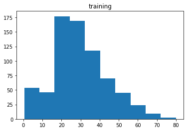


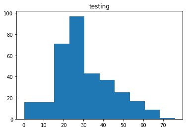


```python
combined=pd.concat([train_data,test_data])
plt.hist(combined['Age'])
plt.title('combined')
```


    Text(0.5, 1.0, 'combined')


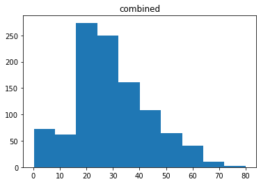


```python
plt.hist(combined['Fare'])
plt.title('Fare')
plt.show()
```


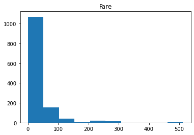


```python
#referred https://www.kaggle.com/kenjee/titanic-project-example 
#also https://www.youtube.com/watch?v=I3FBJdiExcg&list=WL&index=1&ab_channel=KenJee

print(combined.Age.mean())
print(combined.Age.median())

test_data.Fare=test_data.Fare.fillna(combined.Age.median())

train_data.Age=train_data.Age.fillna(combined.Age.mean())
test_data.Age=test_data.Age.fillna(combined.Age.mean())


print('\ntrain null val : ')
print(train_data.isnull().sum())

print('\ntest null val : ')
print(test_data.isnull().sum())
```

    29.881137667304014
    28.0
    
    train null val : 
    PassengerId      0
    Survived         0
    Pclass           0
    Name             0
    Sex              0
    Age              0
    SibSp            0
    Parch            0
    Ticket           0
    Fare             0
    Cabin          687
    Embarked         2
    dtype: int64
    
    test null val : 
    PassengerId      0
    Pclass           0
    Name             0
    Sex              0
    Age              0
    SibSp            0
    Parch            0
    Ticket           0
    Fare             0
    Cabin          327
    Embarked         0
    dtype: int64
    


```python
#referred https://www.kaggle.com/kenjee/titanic-project-example 
#also https://www.youtube.com/watch?v=I3FBJdiExcg&list=WL&index=1&ab_channel=KenJee
train_data['norm_fare']=np.log(train_data.Fare+1)
test_data['norm_fare']=np.log(test_data.Fare+1)


plt.hist(train_data['norm_fare'])
plt.show()
plt.hist(train_data['Fare'])
plt.show()
plt.hist(test_data['norm_fare'])
plt.show()
plt.hist(test_data['Fare'])
plt.show()
```


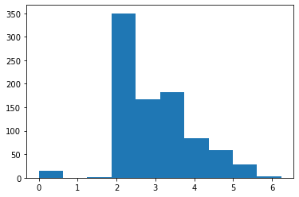


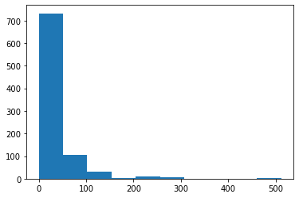


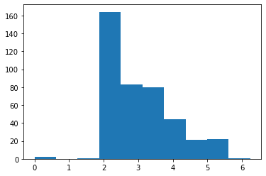


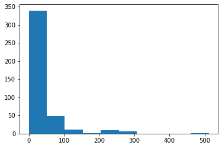


```python
from sklearn.ensemble import RandomForestClassifier
from sklearn.neighbors import KNeighborsClassifier
from sklearn.svm import SVC
from sklearn.ensemble import VotingClassifier

y = train_data["Survived"]

features = ["Pclass", "Sex", "SibSp", "Parch","Age","norm_fare"]
X = pd.get_dummies(train_data[features])
X_test = pd.get_dummies(test_data[features])

model = RandomForestClassifier(n_estimators=100, max_depth=5, random_state=1)

#referred https://www.kaggle.com/kenjee/titanic-project-example 
#also https://www.youtube.com/watch?v=I3FBJdiExcg&list=WL&index=1&ab_channel=KenJee

#kn = KNeighborsClassifier()
#sv = SVC(probability = True)
#model=VotingClassifier(estimators = [('knn',kn),('rf',rf),('svm',sv)], voting = 'soft')

model.fit(X, y)
predictions = model.predict(X_test)

output = pd.DataFrame({'PassengerId': test_data.PassengerId, 'Survived': predictions})
output.to_csv('my_submission.csv', index=False)
print("Your submission was successfully saved!")
```

    Your submission was successfully saved!
    


```python

```


