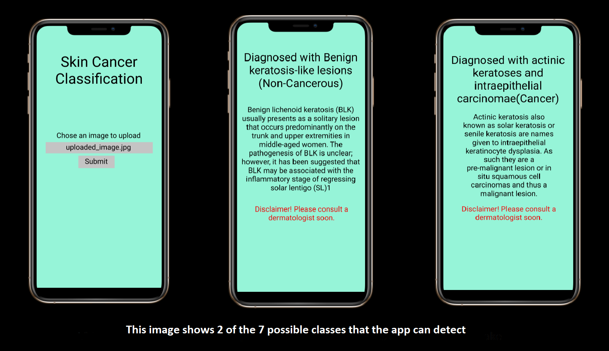

 _Switch to dark mode for better readability_ 

[*CLICK HERE to download the project proposal*](./ProjectProposalforSkinCancerClassification.pdf)

[_Link to my Jupyter Notebook_](https://github.com/rohanmandrekar/Skin-Cancer-Classification/blob/main/Skin_Cancer_Detection.ipynb)

[Link to YouTube video for the webapp](https://youtu.be/IWHKOQYbfP0)

[_Link to my Kaggle submission_](https://www.kaggle.com/rohanmandrekar/skin-cancer-classification-using-cnn-96-test-acc)

# Motivation(Why I chose this project):
According to [skincancer.org](https://www.skincancer.org/skin-cancer-information/skin-cancer-facts/) Skin cancer is the most common cancer in the United States and worldwide. 1 in 5 Americans will develop skin cancer by the age of 70. Early detection of skin cancer is vital to ensure successful treatment. An app that can self-diagnose any potential skin cancer within seconds with the ease of a button click can prove to be beneficial by greatly bringing down to cost and time for testing. Since the app also detects some diseases which appear like cancer, but are non-cancerous, it can alleviate the stress of people in such cases.

## What the app will look like:
 

## My Contribution:
I designed my own classifier from scratch. below is the architecture for the CNN model:

    Model: "sequential"
    _________________________________________________________________
    Layer (type)                 Output Shape              Param #   
    =================================================================
    conv2d (Conv2D)              (None, 28, 28, 16)        448       
    _________________________________________________________________
    max_pooling2d (MaxPooling2D) (None, 14, 14, 16)        0         
    _________________________________________________________________
    batch_normalization (BatchNo (None, 14, 14, 16)        64        
    _________________________________________________________________
    conv2d_1 (Conv2D)            (None, 12, 12, 32)        4640      
    _________________________________________________________________
    conv2d_2 (Conv2D)            (None, 10, 10, 64)        18496     
    _________________________________________________________________
    max_pooling2d_1 (MaxPooling2 (None, 5, 5, 64)          0         
    _________________________________________________________________
    batch_normalization_1 (Batch (None, 5, 5, 64)          256       
    _________________________________________________________________
    conv2d_3 (Conv2D)            (None, 3, 3, 128)         73856     
    _________________________________________________________________
    conv2d_4 (Conv2D)            (None, 1, 1, 256)         295168    
    _________________________________________________________________
    flatten (Flatten)            (None, 256)               0         
    _________________________________________________________________
    dropout (Dropout)            (None, 256)               0         
    _________________________________________________________________
    dense (Dense)                (None, 256)               65792     
    _________________________________________________________________
    batch_normalization_2 (Batch (None, 256)               1024      
    _________________________________________________________________
    dropout_1 (Dropout)          (None, 256)               0         
    _________________________________________________________________
    dense_1 (Dense)              (None, 128)               32896     
    _________________________________________________________________
    batch_normalization_3 (Batch (None, 128)               512       
    _________________________________________________________________
    dense_2 (Dense)              (None, 64)                8256      
    _________________________________________________________________
    batch_normalization_4 (Batch (None, 64)                256       
    _________________________________________________________________
    dropout_2 (Dropout)          (None, 64)                0         
    _________________________________________________________________
    dense_3 (Dense)              (None, 32)                2080      
    _________________________________________________________________
    batch_normalization_5 (Batch (None, 32)                128       
    _________________________________________________________________
    dense_4 (Dense)              (None, 7)                 231       
    =================================================================
    Total params: 504,103
    Trainable params: 502,983
    Non-trainable params: 1,120
    _________________________________________________________________
    

### References:

[1]

[2]

[3]

[4]

